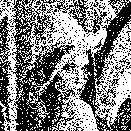
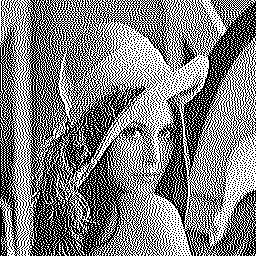
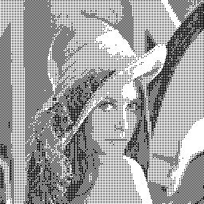
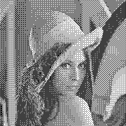

# Examples

## Average

## Random

## Gaussian Random

## Simple

## Error Diffusion

### Floyd-Steinberg

### Jarvis, Judice, and Ninke Dithering

### Stucki Dithering

### Atkinson Dithering

### Burkes Dithering

### Sierra Dithering

### Two-Row Sierra

### Sierra Lite

## Ordered

### Bayer 2x2

### Bayer 4x4

### Bayer 8x8

### Cluster 4x4

### Cluster 8x8

